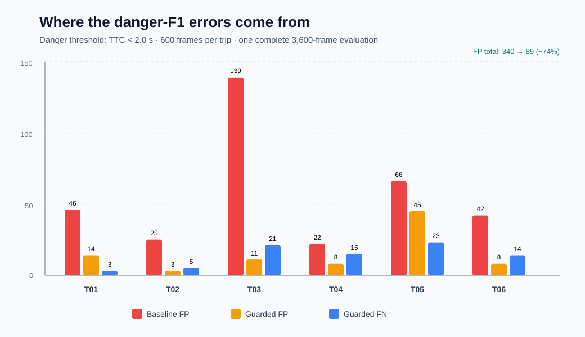

# Guardian TTC danger benchmark — guarded candidate

Date: 2026-07-27  
Branch: `research/phase-03-04-f1`  
Dataset: six practice trips, 600 frames each (3,600 frames total)  
Danger definition: predicted or ground-truth TTC `< 2.0 s`

## Decision

Keep `track_p35_guarded` as the current accuracy/latency candidate.

It raises evaluator macro danger-F1 from `0.402` to `0.564`, raises
composite score from `28.7` to `39.7`, and raises the worst-trip composite
from `4.6` to `30.7`. Its measured one-pass compute P95 is `54.40 ms`, below
the current strict `<75 ms` gate.

The candidate is a strong improvement, but the F1 work is not complete.
The next target is macro F1 `>=0.60` without losing the latency gate.

## Headline comparison

| Metric | Stage 2A `track_p35` | Guarded candidate | Change |
|---|---:|---:|---:|
| Macro danger-F1 | 0.402 | 0.564 | +0.162 |
| Composite | 28.7 | 39.7 | +11.0 |
| Worst-trip composite | 4.6 | 30.7 | +26.1 |
| TP | 135 | 123 | -12 |
| FP | 340 | 89 | -251 |
| FN | 69 | 81 | +12 |
| Inverse-TTC MAE | 0.2455 | 0.1198 | -0.1257 |
| Critical TTC MAE | 22.125 s | 44.806 s | +22.681 s |

The improvement comes from a large false-positive reduction. The cost is
12 fewer true-positive frames and worse direct critical-TTC MAE. This is why
both F1 and TTC-error metrics must remain visible; the candidate must not be
described as universally better.

## Per-trip danger classification

| Trip | Baseline TP/FP/FN | Guarded TP/FP/FN | Guarded precision | Guarded recall | Guarded F1 | Composite |
|---|---:|---:|---:|---:|---:|---:|
| T01 | 7 / 46 / 3 | 7 / 14 / 3 | 0.333 | 0.700 | 0.452 | 41.2 |
| T02 | 13 / 25 / 5 | 13 / 3 / 5 | 0.812 | 0.722 | 0.765 | 46.3 |
| T03 | 14 / 139 / 15 | 8 / 11 / 21 | 0.421 | 0.276 | 0.333 | 30.7 |
| T04 | 41 / 22 / 11 | 37 / 8 / 15 | 0.822 | 0.712 | 0.763 | 50.1 |
| T05 | 13 / 66 / 22 | 12 / 45 / 23 | 0.211 | 0.343 | 0.261 | 31.0 |
| T06 | 47 / 42 / 13 | 46 / 8 / 14 | 0.852 | 0.767 | 0.807 | 39.0 |



## What is still wrong

1. **T05 false positives are now the largest error source.** One long-lived
   road/fence-like track accounts for most of the remaining 45 false alarms.
   Its geometry overlaps real obstacles, so another global threshold is likely
   to remove true positives too.
2. **T03 recall is too low.** The guard removes the original road-surface
   alarms, but also rejects six true-positive frames because their estimated
   speed, confidence, or motion residual is unstable.
3. **The current depth-to-TTC value is poorly calibrated even when the danger
   class is correct.** Critical TTC MAE worsens, despite inverse-TTC MAE and F1
   improving.

## Implemented guard

- Narrow collision corridor: top width `0.10`, bottom width `0.50`.
- Require track bottom at or below `0.50` of image height.
- Require track height at least `0.05` of image height.
- Require confidence `>=0.75`.
- Require depth `<=20 m`.
- Reject closing speed `>20 m/s`.
- Reject motion-fit residual `>0.8 m`.

These are physical plausibility gates, not trip-specific frame exceptions.
The baseline policy remains selectable for reproducibility.

## Latency

| Stage | P50 | P95 | P99 |
|---|---:|---:|---:|
| Stereo pair | 22.06 ms | 30.34 ms | 32.85 ms |
| Ground model | 13.56 ms | 17.89 ms | 23.41 ms |
| Components | 2.17 ms | 3.26 ms | 3.97 ms |
| Tracking/TTC | 1.29 ms | 2.75 ms | 3.78 ms |
| Total compute | 41.25 ms | 54.40 ms | 62.24 ms |
| End-to-end with file I/O | 43.39 ms | 56.90 ms | 64.86 ms |

This latency table is from one complete 3,600-frame experiment pass. The
earlier frozen Stage 2B latency result used five repeats. Before final
deployment promotion, rerun the guarded policy using the five-repeat benchmark
command below.

## Reproduce

```powershell
.\.venv\Scripts\python.exe ai_cv\phases\02_detection_tracking\src\benchmark_stereo_latency.py `
  --backend sgbm --precision fp32 --repeats 5 --warmup-frames 100 `
  --practice-root Practice_Dataset `
  --starter-root Package_starterkit\package_starterkit `
  --ttc-policy guarded `
  --output-root ai_cv\outputs\benchmarks\phase03_guarded_official
```

Use `--ttc-policy baseline` to reproduce the frozen Stage 2A behavior.

## Next experiment

Do not continue broad threshold sweeps. Add component identity evidence
(appearance/semantic obstacle support or stronger temporal shape consistency)
to reject the persistent T05 road/fence track, then improve the T03 depth and
motion fit. Accept the next change only if macro F1 improves without pushing
compute P95 to `>=75 ms` or materially worsening the already degraded
critical-TTC MAE.
